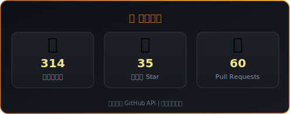

<!-- ==================== 头部 ==================== -->

<h1 style="margin: 24px 0 8px; font-size: 2.6rem; font-weight: 700; background: linear-gradient(135deg, #1F2937 0%, #92400E 50%, #D97706 100%); -webkit-background-clip: text; -webkit-text-fill-color: transparent; background-clip: text; letter-spacing: -0.5px;">你好，我是 jieefeng</h1>

<!-- 打字动画 -->
<picture>
  <source media="(prefers-color-scheme: dark)" srcset="https://readme-typing-svg.demolab.com/?lines=AI+%E5%B7%A5%E7%A8%8B%E5%B8%88+%7C+RAG+%E6%8E%A2%E7%B4%A2%E8%80%85;%E5%85%A8%E6%A0%88%E5%BC%80%E5%8F%91+%7C+%E5%90%8E%E7%AB%AF%E6%9E%B6%E6%9E%84%E5%B8%88;Always+building%2C+always+learning&font=Fira+Code&center=true&vCenter=true&width=500&height=65&duration=3000&pause=1500&color=F59E0B&background=0D111700&size=14&letterSpacing=0.5" />
  <source media="(prefers-color-scheme: light)" srcset="https://readme-typing-svg.demolab.com/?lines=AI+%E5%B7%A5%E7%A8%8B%E5%B8%88+%7C+RAG+%E6%8E%A2%E7%B4%A2%E8%80%85;%E5%85%A8%E6%A0%88%E5%BC%80%E5%8F%91+%7C+%E5%90%8E%E7%AB%AF%E6%9E%B6%E6%9E%84%E5%B8%88;Always+building%2C+always+learning&font=Fira+Code&center=true&vCenter=true&width=500&height=65&duration=3000&pause=1500&color=B45309&background=FFFFFF00&size=14&letterSpacing=0.5" />
  
</picture>

  热衷于构建智能化系统，擅长 Python、Java 与现代 Web 技术。

  当前聚焦于检索增强生成（RAG）、后端架构设计与工程化实践。

 

<!-- ==================== 社交链接 ==================== -->

&nbsp;

  

---

<!-- ==================== Profile Trophy ==================== -->

<h2 align="center" style="font-size: 1.3rem; font-weight: 600; letter-spacing: 1px;">
  📊 数据统计
</h2>

  <picture>
    <source media="(prefers-color-scheme: dark)" srcset="./assets/achievements-card.svg" />
    <source media="(prefers-color-scheme: light)" srcset="./assets/achievements-card-light.svg" />
    
  </picture>

---

<!-- ==================== 技术栈 ==================== -->

<h2 align="center" style="font-size: 1.3rem; font-weight: 600; letter-spacing: 1px;">
  ⚡ 技术栈
</h2>

  <picture>
    <source media="(prefers-color-scheme: dark)" srcset="https://skillicons.dev/icons?i=python,java,typescript,vuejs,spring,mysql,redis,rabbitmq,kafka,docker,linux,git,langchain&theme=onDark" />
    <source media="(prefers-color-scheme: light)" srcset="https://skillicons.dev/icons?i=python,java,typescript,vuejs,spring,mysql,redis,rabbitmq,kafka,docker,linux,git,langchain&theme=onLight" />
    
  </picture>
   
  

---

<!-- ==================== 正在做什么 ==================== -->

<h2 align="center" style="font-size: 1.3rem; font-weight: 600; letter-spacing: 1px;">
  🔭 正在做什么
</h2>

  🧠 探索 RAG 与大语言模型的实际落地场景 
  🏗️ 设计高可用、可扩展的后端系统架构 
  🛠️ 深耕工程化实践，提升研发效能与代码质量

---

<!-- ==================== GitHub 统计 ==================== -->

<h2 align="center" style="font-size: 1.3rem; font-weight: 600; letter-spacing: 1px;">
  📊 GitHub 统计
</h2>

  <picture>
    <source media="(prefers-color-scheme: dark)" srcset="./assets/stats-card.svg" />
    <source media="(prefers-color-scheme: light)" srcset="./assets/stats-card-light.svg" />
    
  </picture>
  &nbsp;&nbsp;
  <picture>
    <source media="(prefers-color-scheme: dark)" srcset="./assets/langs-card.svg" />
    <source media="(prefers-color-scheme: light)" srcset="./assets/langs-card-light.svg" />
    
  </picture>

  <picture>
    <source media="(prefers-color-scheme: dark)" srcset="https://github-readme-activity-graph.vercel.app/graph?username=jieefeng&bg_color=0D1117&color=F59E0B&line=D97706&point=FDE68A&area=true&area_color=92400E&hide_border=true&locale=cn" />
    <source media="(prefers-color-scheme: light)" srcset="https://github-readme-activity-graph.vercel.app/graph?username=jieefeng&bg_color=FFFBEB&color=B45309&line=D97706&point=92400E&area=true&area_color=FEF3C7&hide_border=true&locale=cn" />
    
  </picture>

---

<!-- ==================== 贡献蛇形动画 ==================== -->

<h2 align="center" style="font-size: 1.3rem; font-weight: 600; letter-spacing: 1px;">
  🐍 贡献动画
</h2>

<picture>
  <source media="(prefers-color-scheme: dark)" srcset="https://raw.githubusercontent.com/jieefeng/jieefeng/output/github-snake-dark.svg" />
  <source media="(prefers-color-scheme: light)" srcset="https://raw.githubusercontent.com/jieefeng/jieefeng/output/github-snake.svg" />
  
</picture>

---

<!-- ==================== 访客统计 ==================== -->

<h2 align="center" style="font-size: 1.3rem; font-weight: 600; letter-spacing: 1px;">
  👀 访客统计
</h2>

  <picture>
    <source media="(prefers-color-scheme: dark)" srcset="./assets/views-card.svg" />
    <source media="(prefers-color-scheme: light)" srcset="./assets/views-card-light.svg" />
    
  </picture>

---

  <i>感谢访问！</i> &nbsp;|&nbsp; <i>Last updated: auto-daily via GitHub Actions</i>

