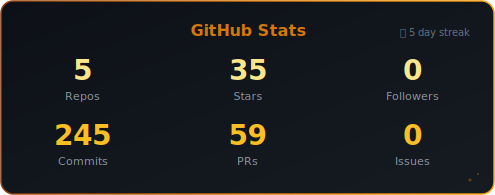
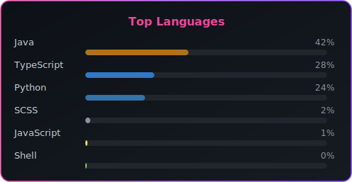

<!-- ==================== 头部 ==================== -->

<h1 style="margin: 24px 0 8px; font-size: 2.6rem; font-weight: 700; background: linear-gradient(135deg, #F8F8FF 0%, #A78BFA 40%, #F472B6 70%, #F59E0B 100%); -webkit-background-clip: text; -webkit-text-fill-color: transparent; background-clip: text; letter-spacing: -0.5px;">你好，我是 jieefeng</h1>

  AI&nbsp;&middot;&nbsp;
  RAG&nbsp;&middot;&nbsp;
  全栈开发

  热衷于构建智能化系统，擅长 Python、Java 与现代 Web 技术。

  当前聚焦于检索增强生成（RAG）、后端架构设计与工程化实践。

 

<!-- ==================== 社交链接 ==================== -->

&nbsp;

  

---

<!-- ==================== 技术栈 ==================== -->

<h2 align="center" style="font-size: 1.3rem; font-weight: 600; letter-spacing: 1px;">
  技术栈
</h2>

  
  
  
  
  
  

  
  
  
  

---

<!-- ==================== GitHub 统计 ==================== -->

<h2 align="center" style="font-size: 1.3rem; font-weight: 600; letter-spacing: 1px;">
  GitHub 统计
</h2>

  

  

---

<!-- ==================== 访客统计 ==================== -->

<h2 align="center" style="font-size: 1.3rem; font-weight: 600; letter-spacing: 1px;">
  访客统计
</h2>

  

---

  <i>感谢访问！</i>

