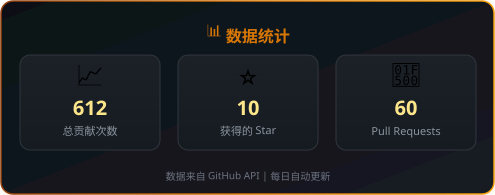
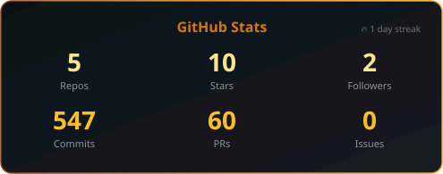
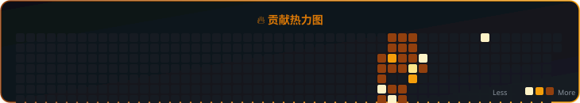
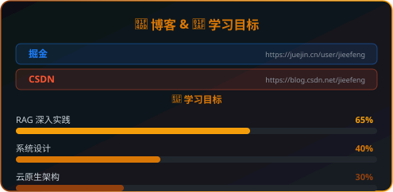

<!-- ==================== 头部 ==================== -->

<h1 style="margin: 24px 0 8px; font-size: 2.6rem; font-weight: 700; background: linear-gradient(135deg, #1F2937 0%, #92400E 50%, #D97706 100%); -webkit-background-clip: text; -webkit-text-fill-color: transparent; background-clip: text; letter-spacing: -0.5px;">你好，我是 jieefeng</h1>

<!-- 打字动画（本地 SVG） -->
<picture>
  <source media="(prefers-color-scheme: dark)" srcset="./assets/typing-card.svg" />
  <source media="(prefers-color-scheme: light)" srcset="./assets/typing-card-light.svg" />
  
</picture>

  热衷于构建智能化系统，擅长 Python、Java 与现代 Web 技术。

  当前聚焦于检索增强生成（RAG）、后端架构设计与工程化实践。

 

<!-- ==================== 社交链接 ==================== -->

&nbsp;

  

---

<!-- ==================== 数据统计 ==================== -->

<h2 align="center" style="font-size: 1.3rem; font-weight: 600; letter-spacing: 1px;">
  📊 数据统计
</h2>

  <picture>
    <source media="(prefers-color-scheme: dark)" srcset="./assets/achievements-card.svg" />
    <source media="(prefers-color-scheme: light)" srcset="./assets/achievements-card-light.svg" />
    
  </picture>

---

<!-- ==================== 技术栈（本地 SVG） ==================== -->

<h2 align="center" style="font-size: 1.3rem; font-weight: 600; letter-spacing: 1px;">
  ⚡ 技术栈
</h2>

  <picture>
    <source media="(prefers-color-scheme: dark)" srcset="./assets/skills-card.svg" />
    <source media="(prefers-color-scheme: light)" srcset="./assets/skills-card-light.svg" />
    
  </picture>

---

<!-- ==================== 正在做什么 ==================== -->

<h2 align="center" style="font-size: 1.3rem; font-weight: 600; letter-spacing: 1px;">
  🔭 正在做什么
</h2>

  🧠 探索 RAG 与大语言模型的实际落地场景 
  🏗️ 设计高可用、可扩展的后端系统架构 
  🛠️ 深耕工程化实践，提升研发效能与代码质量

---

<!-- ==================== 置顶项目（本地 SVG） ==================== -->

<h2 align="center" style="font-size: 1.3rem; font-weight: 600; letter-spacing: 1px;">
  📌 置顶项目
</h2>

  <picture>
    <source media="(prefers-color-scheme: dark)" srcset="./assets/pinned-card.svg" />
    <source media="(prefers-color-scheme: light)" srcset="./assets/pinned-card-light.svg" />
    
  </picture>

---

<!-- ==================== GitHub 统计 ==================== -->

<h2 align="center" style="font-size: 1.3rem; font-weight: 600; letter-spacing: 1px;">
  📊 GitHub 统计
</h2>

  <picture>
    <source media="(prefers-color-scheme: dark)" srcset="./assets/stats-card.svg" />
    <source media="(prefers-color-scheme: light)" srcset="./assets/stats-card-light.svg" />
    
  </picture>
  &nbsp;&nbsp;
  <picture>
    <source media="(prefers-color-scheme: dark)" srcset="./assets/langs-card.svg" />
    <source media="(prefers-color-scheme: light)" srcset="./assets/langs-card-light.svg" />
    
  </picture>

---

<!-- ==================== 贡献热力图（本地 SVG） ==================== -->

<h2 align="center" style="font-size: 1.3rem; font-weight: 600; letter-spacing: 1px;">
  🔥 贡献热力图
</h2>

  <picture>
    <source media="(prefers-color-scheme: dark)" srcset="./assets/activity-card.svg" />
    <source media="(prefers-color-scheme: light)" srcset="./assets/activity-card-light.svg" />
    
  </picture>

---

<!-- ==================== 博客 & 学习目标（本地 SVG） ==================== -->

<h2 align="center" style="font-size: 1.3rem; font-weight: 600; letter-spacing: 1px;">
  📝 博客 & 🎯 学习目标
</h2>

  <picture>
    <source media="(prefers-color-scheme: dark)" srcset="./assets/blog-card.svg" />
    <source media="(prefers-color-scheme: light)" srcset="./assets/blog-card-light.svg" />
    
  </picture>

---

<!-- ==================== 贡献蛇形动画 ==================== -->

<h2 align="center" style="font-size: 1.3rem; font-weight: 600; letter-spacing: 1px;">
  🐍 贡献动画
</h2>

<picture>
  <source media="(prefers-color-scheme: dark)" srcset="https://raw.githubusercontent.com/jieefeng/jieefeng/output/github-snake-dark.svg" />
  <source media="(prefers-color-scheme: light)" srcset="https://raw.githubusercontent.com/jieefeng/jieefeng/output/github-snake.svg" />
  
</picture>

---

<!-- ==================== 访客统计 ==================== -->

<h2 align="center" style="font-size: 1.3rem; font-weight: 600; letter-spacing: 1px;">
  👀 访客统计
</h2>

  <picture>
    <source media="(prefers-color-scheme: dark)" srcset="./assets/views-card.svg" />
    <source media="(prefers-color-scheme: light)" srcset="./assets/views-card-light.svg" />
    
  </picture>

---

  <i>感谢访问！</i> &nbsp;|&nbsp; <i>Last updated: auto-daily via GitHub Actions</i>

