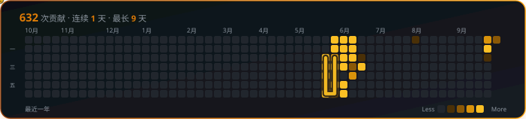

<!-- ==================== 头部 ==================== -->

<h1>你好，我是 jieefeng 👋</h1>

<picture>
  <source media="(prefers-color-scheme: dark)" srcset="./assets/typing-card.svg" />
  <source media="(prefers-color-scheme: light)" srcset="./assets/typing-card-light.svg" />
  
</picture>

  热衷于构建智能化系统，擅长 <b>Python、Java 与现代 Web 技术</b>。 
  当前聚焦 <b>检索增强生成（RAG）</b>、后端架构设计与工程化实践。

---

<!-- ==================== 当前方向 ==================== -->

<h2 align="center">🎯 当前方向</h2>

  🔭 &nbsp;<b>在做</b>：RAG 检索链路优化 · 后端服务工程化 
  🌱 &nbsp;<b>在学</b>：Embedding 检索调优 · 系统设计 · 云原生 
  💬 &nbsp;<b>可聊</b>：Python / Java 后端、RAG 落地、全栈开发

---

<!-- ==================== 贡献热力图（本地生成 · 每日自动更新） ==================== -->

<h2 align="center">🔥 贡献热力图</h2>

  <picture>
    <source media="(prefers-color-scheme: dark)" srcset="./assets/activity-card.svg" />
    <source media="(prefers-color-scheme: light)" srcset="./assets/activity-card-light.svg" />
    
  </picture>

---

<!-- ==================== 访客统计 ==================== -->

  

  <i>感谢访问！</i> &nbsp;|&nbsp; <i>访客计数实时更新 · 卡片由 GitHub Actions 每日 9:00（北京时间）本地生成</i>

